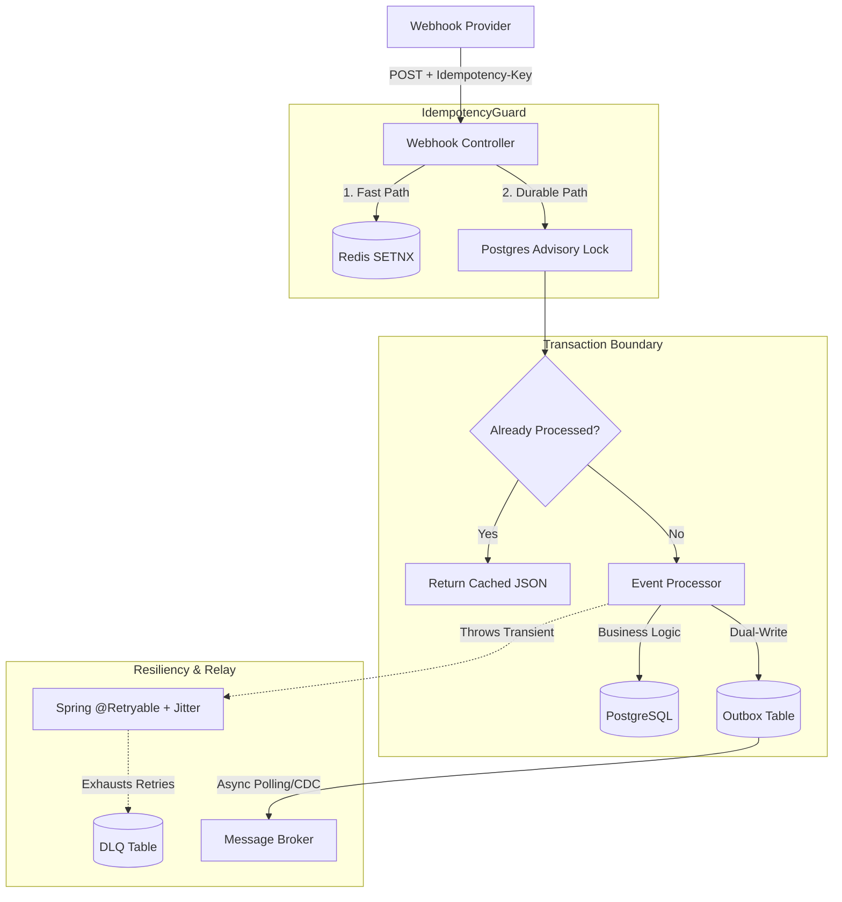

# idempotent-webhook-processor

> Exactly-once webhook ingestion engine. Stripe-style idempotency keys, dead-letter queue, and the transactional outbox pattern.

## The Problem

In a distributed system, you cannot rely on the network to tell you if an operation succeeded. If a webhook provider (like Stripe or GitHub) sends a `payment.succeeded` event, but the HTTP `200 OK` acknowledgment gets dropped by a flaky network, the provider will retry sending the exact same event. Without strict idempotency, that retry results in processing the payment twice—a critical financial bug. This project is a production-grade ingestion engine designed to guarantee **exactly-once processing** under high concurrency, ensuring that duplicate webhooks are safely deflected and transient errors are handled without data loss.

## Architecture

This system implements a **Two-Tier Locking Strategy**, a **Transactional Outbox**, and a **Dead Letter Queue (DLQ)**.



## Core Design Decisions

### 1\. Two-Tier Idempotency Locking

* **The Fast Path (Redis):** Uses `SETNX` with a TTL to instantly deflect parallel duplicate requests (the "Thundering Herd") before they consume database connection pools. Fail-open by design.
* **The Durable Path (Postgres):** Uses transaction-level advisory locks (`pg_try_advisory_xact_lock`). This guarantees that even if Redis goes down, no two identical keys can execute business logic concurrently.

### 2\. The Transactional Outbox

To solve the "Dual-Write Problem" (saving to a database and publishing to Kafka synchronously), this service writes to an `outbox_events` table within the *exact same Postgres transaction* as the core business logic. A background relay asynchronously sweeps the outbox, guaranteeing at-least-once delivery to downstream services without holding up the HTTP response.

### 3\. Jittered Retries & Dead Letter Queue (DLQ)

Transient errors (e.g., API timeouts) are intercepted by Spring Retry with exponential backoff and jitter. If an event fails all retries, a `REQUIRES_NEW` transaction safely parks the raw payload and stack trace in a `dead_letter_events` table for manual on-call replay.

## API Usage

```bash
curl -X POST http://localhost:8080/webhooks/payment.succeeded \
  -H "Idempotency-Key: a1b2c3d4-5678-90ef" \
  -H "Content-Type: application/json" \
  -d '{"userId": "user_123", "amount": 5000}'
```

**Responses:**

* `202 Accepted` - Successfully processed, or returning a cached success.
* `400 Bad Request` - Key reused with a different payload hash.
* `409 Conflict` - Webhook is actively being processed by another thread.

## Running Locally

Spin up the entire stack (App, Postgres, Redis, Prometheus, Grafana, and Flyway Migrations) in one command:

```bash
docker-compose up -d
./gradlew bootRun
```

## Running Tests

Integration tests use **Testcontainers** to spin up real PostgreSQL and Redis containers, proving the native database locks and unique constraints hold up under load.

```bash
./gradlew test
```

### Chaos testing simulates mid-flight server crashes to verify that the system recovers gracefully without processing duplicates or losing data.
`make chaos-test` 

## Load Test Results

Load testing was performed using **k6** against a local Docker environment, running two simultaneous scenarios: High-throughput unique traffic, and 50 concurrent virtual users violently spamming the exact same idempotency key to test race condition deflection.

| Metric | Result | Notes |
| :--- | :--- | :--- |
| **RPS (Throughput)** | `8,837 req/sec` | Handled \~90,000 requests in 10 seconds locally. |
| **P50 Latency (Median)**| `5.14 ms` | Redis fast-path successfully short-circuits duplicates. |
| **P95 Latency** | `56.88 ms` | Complete processing including Outbox and DB inserts. |
| **Duplicate Processing** | `0%` | Verified by strict Testcontainers E2E assertions. |
| **DLQ Capture Rate** | `100%` | Terminal failures captured securely without transaction rollbacks. |

-----
